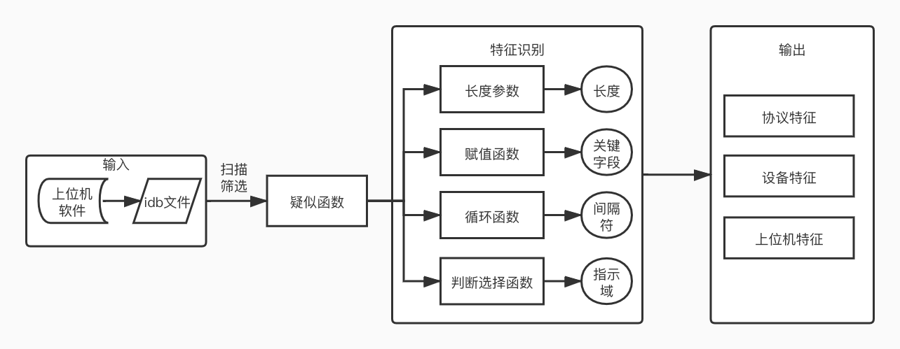

# protocol reverse

协议逆向

## reverse.py

获取协议格式

### 架构图

### 环境依赖

+ python 2.7

+ ida pro 7

+ python-idb
+ vivisect   

### 输入

idb文件

### To-do List

- [x] 导入idb文件
  - [ ] idb问题：No handlers could be found for logger "idb.fileformat",原因：idb.fileformat:section class not implemented: id2
  - [ ] idb问题：idb库 功能不齐全
- [x] 筛选疑似函数
  - [x] 从import中筛选出通信函数
  - [ ] 添加其他通信函数
  - [ ] 识别出通信函数的封装函数
- [ ] 特识别征
  - [ ] 长度
  - [ ] 赋值
  - [ ] 循环
  - [ ] 选择
- [ ] 输出
  - [ ] 协议特征
  - [ ] 设备特征
  - [ ] 上位机特征

